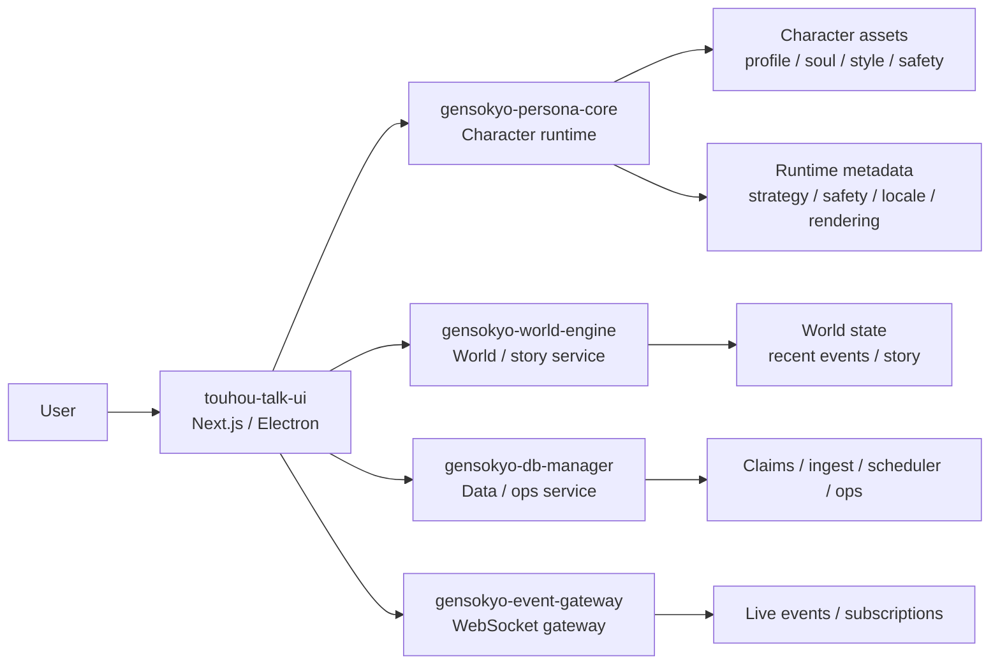
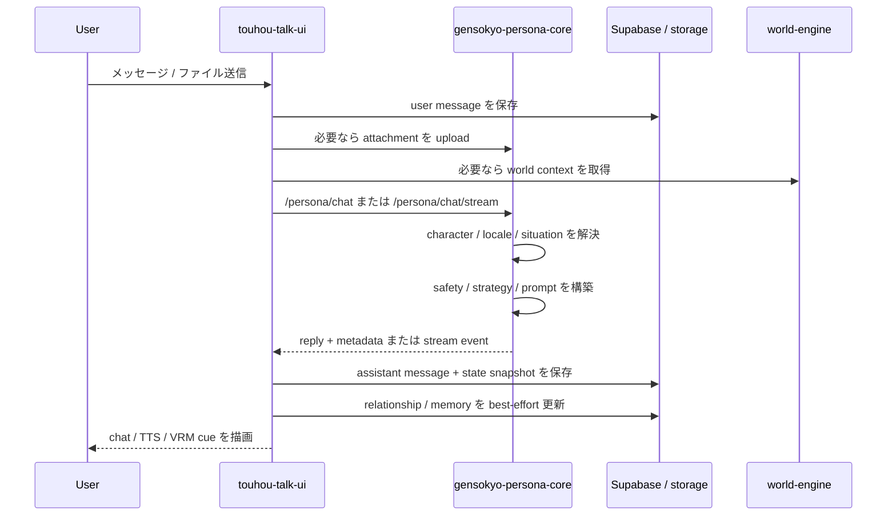

# gensokyo-chat

`gensokyo-chat` は、backend 主導のキャラクター runtime を中核にしたマルチモジュール構成の Character AI ワークスペースです。
Web UI、デスクトップ UI、周辺サービスが同じキャラクター基盤を共有できるように、キャラクター制御を表示層から切り離して設計しています。
実態としては単一のチャットアプリというより、キャラクター runtime 基盤を中心に複数の surface と支援サービスを載せた構成です。

## Quick Read

- Project summary: UI 主導ではなく backend 主導の character runtime を中心にした full-stack Character AI platform
- Scope: runtime、frontend 連携、周辺 service boundary をまたぐワークスペース全体を含む
- Technical highlights: backend-owned persona orchestration、構造化 character asset 設計、streaming chat 統合、multi-service 分割
- Why it matters: 単発機能ではなく、system design と product implementation を一体で進めた開発として見せやすい

## Executive summary

このリポジトリは、ひとつの frontend と複数の補助サービスを持つ、再利用可能な character runtime platform として捉えるのが最も実態に近いです。
中核の発想は明快で、character identity、safety、locale 制御、prompt 構成を backend に寄せ、すべての client が同じ character engine を再利用することにあります。

この判断によって、システム全体の形が変わります。

- backend が character behavior の正本になる
- frontend は prompt owner ではなく product surface と orchestration layer になる
- 補助サービスは中核 runtime を汚さずに独立進化できる

## このリポジトリの要点

- FastAPI ベースの backend-first なキャラクター制御
- Next.js 製チャット UI と Electron デスクトップ化
- キャラクターごとの分割アセットによる運用しやすい設計
- 日本語と英語をまたいだ locale-aware な表現制御
- world data、event、database を分離した補助サービス構成

## ポートフォリオとして見せたい軸

このリポジトリは、ポートフォリオとして次のような強みを見せやすい構成です。

- Character AI の backend runtime 設計
- chat、streaming、avatar 連動 UX を含む frontend 実装
- 複数モジュールにまたがる API / service boundary 設計
- 属人的な prompt 文字列ではなく、構造化された character data modeling
- world state、database、event 配信まで含めた周辺サービス設計

強みは単一の画面や単一の endpoint ではなく、同じ character system を複数 client と補助サービスにまたがって破綻なく保つ設計にあります。

## 読み方ガイド

このリポジトリは、読む人によって見たいポイントが違います。その前提で整理しています。

- 採用担当は full-stack AI product としての全体像を短時間で把握できる
- hiring manager は責務分離、技術方針、保守しやすさへの配慮を見やすい
- エンジニアは runtime、streaming、attachment、metadata、service decomposition の実装経路を追いやすい

## 実際に何をしているシステムか

現状のコードベースから読み取れる機能は、単純なチャット応答だけではありません。

- キャラクターごとの chat / streaming 応答
- 添付ファイルの upload / parse と添付考慮型の応答生成
- locale に応じたキャラクター表現の切り替え
- situation 分析と safety を踏まえた応答制御
- relationship score と応答後の memory 更新
- runtime 側での web search / fetch / RAG 補助
- GitHub repository / code 検索補助
- world state、story、visit、tick を扱う補助サービス
- WebSocket による event 配信

## 何を目指しているか

多くのキャラクターチャットは UI 側で prompt を組み立てますが、このリポジトリでは逆に backend がキャラクター挙動の責任を持ちます。
つまり、キャラクター性、safety、locale ごとの表現、prompt 構成を backend 側で一元管理し、UI は入力と表示に集中します。

この設計により、次の点が明確になります。

- クライアントが増えてもキャラクター性を保ちやすい
- キャラクター定義の保守と調整がしやすい
- safety や runtime policy を一箇所で管理できる

## エンジニアリング上の見せ場

このプロジェクトで特に見せやすいのは、次のような仕事です。

- prompt 依存の product logic を再利用可能な backend runtime に落とし込むこと
- situation、behavior、safety、strategy、rendering から成る layered な応答パイプライン設計
- backend 主導の persona 制御を崩さずに frontend を厚くすること
- world logic、database operations、event transport を責務別に分離した multi-service 構成

## このリポジトリの設計思想

このリポジトリの中心的な思想は、character quality は UI の問題ではなく infrastructure の問題でもある、という考え方です。
persona logic を各 client に持たせると surface が増えるほど一貫性が崩れます。
逆に共有 runtime に持たせれば、identity、safety、behavior を composable で検証可能なシステム要素として扱えます。

このリポジトリは、その思想を実装に落とした試みです。

## リポジトリ構成

| Path | 役割 |
| --- | --- |
| `gensokyo-persona-core/` | キャラクター生成、streaming、attachment IO、runtime metadata を担う共有 FastAPI runtime |
| `touhou-talk-ui/` | メインの Next.js フロントエンド、session API 層、desktop 化の入口 |
| `gensokyo-world-engine/` | world state、lore、NPC、visit、tick、story を扱う補助サービス |
| `gensokyo-event-gateway/` | WebSocket ベースの event 配信と subscription 中継層 |
| `gensokyo-db-manager/` | ingest、discovery、claims、schema、ops を扱う database サービス |
| `docs/` | 全体設計と計画ドキュメント |

## モジュールごとの責務分担

各モジュールは、存在理由が重ならないように分けています。

- `gensokyo-persona-core` は応答生成と runtime metadata を持つ
- `touhou-talk-ui` は user-facing な product behavior と session orchestration を持つ
- `gensokyo-world-engine` は world-state と story 系の関心を持つ
- `gensokyo-event-gateway` は live event transport と subscription を持つ
- `gensokyo-db-manager` は data ingest、review、schema 支援、ops を持つ

この分解は、採用文脈では「ディレクトリが増えただけ」ではなく、「境界を設計している」と伝わる部分です。

## Visual overview

### システム全体図



### 1ターンの処理フロー



## システム全体の流れ

1. クライアントが `character_id`、会話履歴、session 情報、添付情報、locale hint を送る
2. `gensokyo-persona-core` が situation、strategy、safety、character assets を解決する
3. backend が prompt を構成して応答を生成する
4. クライアントは描画、stream 表示、操作体験に集中する

加えて、メインの session フローでは UI 側が user message の保存、必要な attachment upload、stream relay、assistant reply 保存、TTS / VRM 用 metadata 付与、応答後の relationship / memory 更新までを橋渡しします。

## 代表的な利用シナリオ

現状のコードから読み取れる代表シナリオは次のとおりです。

- session history を伴う通常の character chat
- incremental event を relay しつつ最終 meta も扱う streaming chat
- file upload / parse を前提にした multimodal turn
- runtime 側で外部情報取得を補助する retrieval-assisted turn
- world-state 系サービスと連携する world-aware interaction
- 同じ product experience を browser 外に持ち出す desktop packaging

## 実装上の具体的なシグナル

このリポジトリは、まだ構想だけを書いているわけではありません。
現状コード上で、すでに次のような実装が確認できます。

- keyword / signal ベースでの明示的な situation classification
- base character trait と situational overlay を合成する behavior resolution
- child、distressed、SOS、dependency、medical、legal を踏まえた safety overlay
- interaction type ごとに verbosity、empathy、directness、question 数、sentence 数を変える response strategy
- root rules、control plane、soul / style、safety、strategy、locale style、history block からの prompt assembly
- safety rewrite、child 向け日本語調整、consistency check を含む post-generation rendering
- 後から分析できる state snapshot の保存
- user-character interaction に紐づく relationship / memory の保存

つまり、product behavior が future intent ではなく、すでに system logic として埋め込まれているのが強みです。

## 主な技術スタック

- Python / FastAPI
- TypeScript / Next.js
- Electron
- 一部モジュールで Supabase 連携

## ローカル開発

### Persona backend

```powershell
cd gensokyo-persona-core
.\.venv\Scripts\python -m uvicorn persona_core.server_persona_os:app --host 127.0.0.1 --port 8000 --reload
```

### Frontend

```powershell
cd touhou-talk-ui
npm install
npm run dev
```

## キャラクターアセット

キャラクター定義は以下にあります。

```text
gensokyo-persona-core/persona_core/characters/<character_id>/
```

代表的なファイルは `profile.json`、`soul.json`、`style.json`、`safety.json`、`situational_behavior.json`、各 locale 定義、localized prompt 群です。
人が編集しやすい粒度を保ちながら、runtime 側で合成しやすい構造にしています。

実行時には、これらのファイルが registry に読み込まれ、locale profile の解決、situation 分析、safety overlay の適用を経て、最終 prompt に組み立てられます。

## 主要な設計判断とトレードオフ

このリポジトリでは、いくつかの判断を意図的に選んでいます。

- frontend の自由度より backend 一貫性を優先する
- opaque な prompt blob より structured な character file を優先する
- text-only の最小応答より metadata-rich な応答を優先する
- 単一 backend への集約より service separation を優先する

そのぶん設計重量は増えますが、inspectability、再利用性、保守性は上がります。

## Persistence / observability の考え方

このリポジトリは、runtime の出力を単なる表示テキストとしてではなく、後から追えるデータとしても扱っています。
現状の UI と backend の接続では、たとえば次の情報を保存しています。

- user / assistant message
- attachment 関連 metadata
- runtime metadata から導出した state snapshot
- relationship score と familiarity
- character scope 単位の user memory 要約

この点は、生成時だけでなく、後から inspect できる system にしているという意味で実務的な強みです。

## エンジニア視点での見どころ

このコードベースには、いくつか明確な設計判断があります。

- prompt ownership を UI ではなく backend に寄せている
- キャラクター定義をファイル分割し、目視で追えるようにしている
- UI は product layer と persistence / streaming の橋渡しに徹している
- 周辺機能を単一 backend に詰め込まず、責務別にサービス分割している

## コード上の根拠

実装を追うなら、まず次のファイルを見るのが早いです。

- `gensokyo-persona-core/persona_core/server_persona_os.py`
- `gensokyo-persona-core/persona_core/runtime/character_chat_runtime.py`
- `gensokyo-persona-core/persona_core/character_runtime/registry.py`
- `touhou-talk-ui/lib/server/session-message-v2/handler.ts`
- `touhou-talk-ui/lib/server/session-message-v2/respond.ts`
- `touhou-talk-ui/lib/server/session-message-v2/stream.ts`
- `touhou-talk-ui/lib/server/session-message-v2/retrieval.ts`

このあたりを読むと、README 上の設計説明が実装にも反映されていることが確認できます。

## 採用担当に伝わりやすいポイント

このリポジトリから読み取りやすいのは、次のような構図です。

- 中核にキャラクター engine がある
- その周囲に複数の client surface がある
- persona 品質と UI 実装を意図的に分離している
- UI 実装だけでなく、runtime 設計、API 設計、データ設計、補助サービス設計まで含んだ開発である

エンジニアには system thinking、service decomposition、runtime 設計、full-stack 実装の幅が伝わりやすく、採用担当には単発機能ではなく設計から運用しやすさまで責任を持つ開発だと伝わりやすい構成です。

## まず読むと全体像が掴みやすい資料

- `gensokyo-persona-core/README.md`
- `gensokyo-persona-core/docs/README.md`
- `touhou-talk-ui/README.ja.md`

## 現在の状態

このリポジトリは、UI 主導の persona 組み立てから backend 主導 runtime への移行をすでに大きく進めています。
現在の軸は安定しており、再利用可能なキャラクター runtime と薄いクライアント構成が中核になっています。

## このリポジトリをどう評価するとよいか

ポートフォリオや面接資料として読むなら、次の観点で見ると価値が掴みやすいです。

- モジュール間の責務分離がどれだけ明確か
- character system がどれだけ構造化データとして表現されているか
- UI が persona logic を持たずに runtime metadata を活用できているか
- 単なる実装量ではなく、product thinking まで含んだ設計になっているか

このリポジトリは、その観点で見ると特に強みが出ます。
