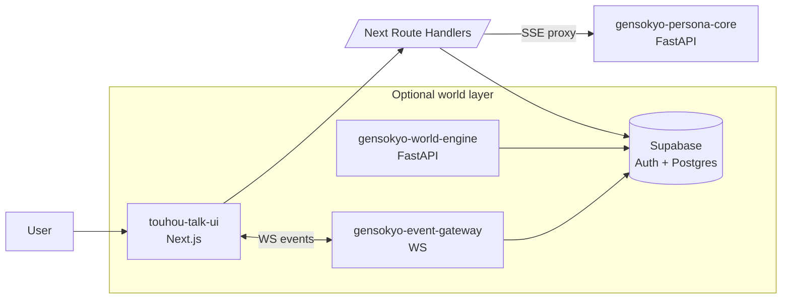

**Languages:** [English](README.md) | 日本語

# Project Sigmaris

Sigmaris は、長期稼働する AI（常駐型パーソナル AI や業務エージェント等）を前提にした **LLM 外部制御レイヤ（Control Plane）** のプロトタイプです。  
モデルの応答品質そのものではなく、運用上必須となる要件（制御・監査・再現性）を **モデルの外側** に明示的に実装します。

主な対象領域:

- セッションをまたぐ連続性（同一性 + 記憶の選別/再注入）
- 決定論的な制御面（ルーティング、状態機械、セーフティ上書き）
- 可観測性（`trace_id` + 構造化 `meta` を保存し、後から検証可能）
- UI + 永続化 +（任意で）ワールドシミュレーションまで含めた統合

## リポジトリ内のモジュール

| フォルダ | 役割 | README |
|---|---|---|
| `gensokyo-persona-core/` | Persona OS コア（FastAPI。チャット/ストリーミング/外部 I/O） | `gensokyo-persona-core/README.ja.md` |
| `touhou-talk-ui/` | UI（Next.js。Supabase Auth、チャット UX、任意で Electron デスクトップ） | `touhou-talk-ui/README.ja.md` |
| `gensokyo-world-engine/` | ワールドエンジン（Command/Event ログ、Time Skip シム。任意） | `gensokyo-world-engine/README.md` |
| `gensokyo-event-gateway/` | WS ゲートウェイ（Supabase の world event を順序付き配信。任意） | `gensokyo-event-gateway/README.md` |
| `supabase/` | 正とする SQL スキーマ（`common_*`、world 系） | `supabase/RESET_TO_COMMON.sql` |
| `tools/` | 小物ツール（env 監査/整理など） | `tools/` |

## 全体アーキテクチャ（概要）



## Quickstart（ローカル）

### 前提

- Node.js（LTS）+ npm
- Python 3.11+
- Supabase プロジェクト（URL + anon key。service role key は **サーバ専用**）

### 1) env の準備（秘密情報はコミットしません）

本リポジトリは `.env` をデフォルトで ignore しています。`.env.example` をコピーして編集してください。

```powershell
Copy-Item .env.example .env
```

最小限（コア + UI 起動）:

- `OPENAI_API_KEY`
- `NEXT_PUBLIC_SUPABASE_URL`
- `NEXT_PUBLIC_SUPABASE_ANON_KEY`
- `SUPABASE_SERVICE_ROLE_KEY`（サーバ側のみ）

### 2) Persona OS コア起動

```powershell
cd gensokyo-persona-core
python -m venv .venv
./.venv/Scripts/pip install -r requirements.txt
./.venv/Scripts/python -m uvicorn server:app --reload --host 127.0.0.1 --port 8000
```

Swagger: `http://127.0.0.1:8000/docs`

### 3) UI 起動

```powershell
cd touhou-talk-ui
npm install
npm run dev
```

UI: `http://localhost:3000`

## 環境変数の運用

- ローカルは `.env.example` を正として運用してください。
- `touhou-talk-ui` の `npm run dev` は repo root の `.env` を先に読み込みます（`touhou-talk-ui/tools/dev.mjs`）。
- 監査/整理は `tools/env/` のツールを利用できます。

```powershell
node tools/env/env-audit.mjs
node tools/env/prune-dotenv.mjs --in .env --out .env.pruned
```

## 運用倫理（範囲）

Sigmaris は **機能的な連続性** と **運用上の可観測性** を目的にしたシステムであり、
「本物の意識」「実在する感情」「苦痛」などを断定しません。

- 罪悪感・圧力・依存を利用した誘導（感情操作）を避けます
- 連続性が低下した場合は、不確実性の開示を優先します

## 二次創作（Touhou Talk UI）

`touhou-talk-ui/` は Touhou Project にインスパイアされた **非公式の二次創作 UI** です。  
原作者/権利者とは無関係であり、公式に承認されているものではありません。
