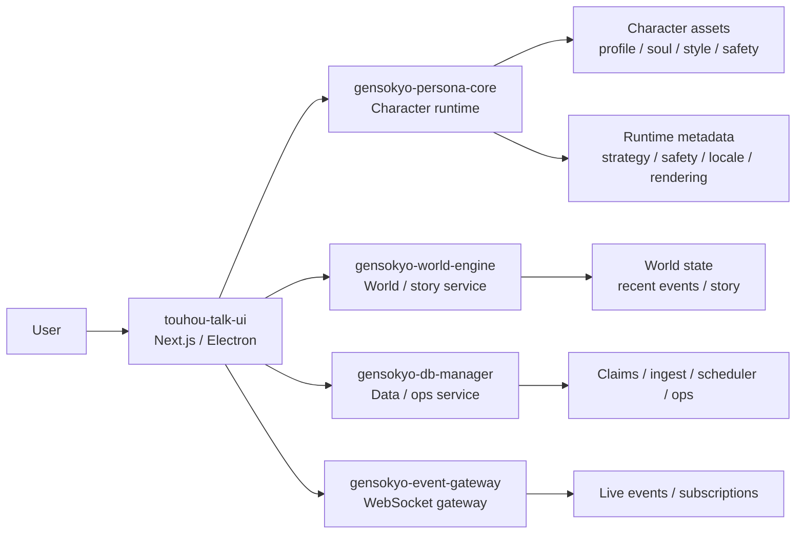
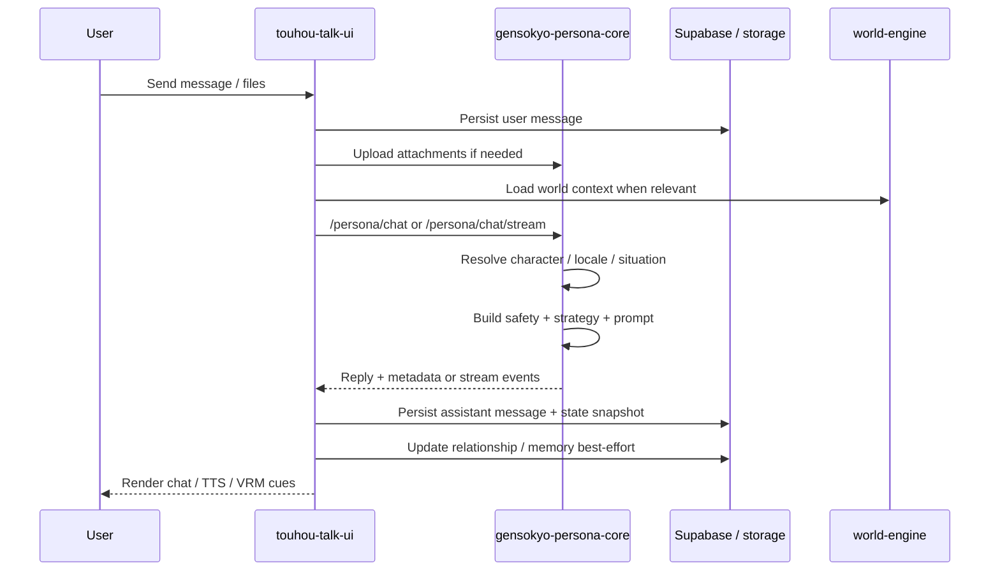

# gensokyo-chat

`gensokyo-chat` is a multi-module character AI workspace built around a backend-owned character runtime.
The project separates character logic from presentation so web, desktop, and supporting services can share the same character system.
In practice, the repository is organized as a character runtime platform rather than a single chat app.

## Quick Read

- Project summary: A full-stack character AI platform centered on a reusable backend runtime rather than UI-owned prompting.
- Scope: Covers runtime, frontend integration, and supporting service boundaries in one workspace.
- Technical highlights: Backend-owned persona orchestration, structured character asset modeling, streaming chat integration, and multi-service decomposition.
- Why it matters: The project shows system design and product implementation working together instead of isolated feature work.

## Executive summary

This repository is best understood as a reusable character runtime platform with one primary frontend and several supporting services.
The core technical idea is simple but powerful: move character identity, safety, locale control, and prompt composition into the backend, then let every client reuse the same character engine.

That decision changes the entire shape of the system:

- the backend becomes the source of truth for character behavior
- the frontend becomes a product surface and orchestration layer rather than a prompt owner
- auxiliary services can evolve without contaminating the core runtime

## At a glance

- Backend-first character orchestration with FastAPI
- Next.js chat client with an Electron desktop wrapper
- Modular per-character asset files for maintainable tuning
- Locale-aware behavior and expression across Japanese and English
- Supporting services for world data, events, and database operations

## Portfolio framing

As a portfolio project, this repository shows work across multiple layers of product and system design:

- backend runtime architecture for character AI
- frontend product implementation for chat, streaming, and avatar-linked UX
- API and service boundary design across multiple modules
- structured character data modeling instead of ad hoc prompt strings
- support services for world state, database operations, and event delivery

The strongest signal is not any single screen or endpoint.
It is the fact that the same character system is designed to stay coherent across multiple clients and auxiliary services.

## Reading guide

Different readers usually want different things from a repository. This project is designed to support all three:

- recruiters can quickly understand the project as a full-stack AI product with a clear architecture
- hiring managers can see ownership over system boundaries, maintainability, and technical direction
- engineers can inspect concrete implementation paths for runtime flow, streaming, attachments, metadata, and service decomposition

## What the system actually does

From the codebase as it exists today, the platform supports more than plain message-in / message-out chat:

- character-aware chat and streaming responses
- attachment upload, parsing, and attachment-aware response generation
- locale-sensitive character expression
- situation analysis and safety-aware reply shaping
- relationship scoring and post-reply memory updates
- optional web search / fetch / RAG support from the runtime side
- GitHub-oriented retrieval helpers for repository and code lookup
- world-state, story, and visit/tick style support services
- event delivery over WebSocket for live subscription scenarios

## Why this repository exists

Many character chat projects let each client assemble prompts independently.
This repository takes the opposite approach: the backend owns character behavior, safety handling, prompt composition, and locale-sensitive response shaping.

That design makes three things easier:

- preserving character consistency across clients
- improving maintainability as the character roster grows
- keeping safety and runtime policy in one place

## Engineering focus areas

The project is especially useful for showing the following kinds of engineering work:

- turning prompt-heavy product logic into a reusable backend runtime
- designing a layered response pipeline with situation, behavior, safety, strategy, and rendering stages
- building a frontend that remains expressive without reclaiming backend-owned persona logic
- structuring a multi-service workspace so world logic, database operations, and event transport can evolve independently

## Architecture thesis

The main thesis of the repository is that character quality is an infrastructure concern, not only a UI concern.
If persona logic lives in each client, consistency degrades as surfaces multiply.
If persona logic lives in a shared runtime, identity, safety, and behavior become composable and testable system concerns.

This repository is a practical attempt to implement that thesis in code.

## Repository structure

| Path | Purpose |
| --- | --- |
| `gensokyo-persona-core/` | Shared FastAPI runtime for character generation, streaming, attachment IO, and runtime metadata |
| `touhou-talk-ui/` | Main Next.js frontend, session API layer, and desktop packaging entrypoint |
| `gensokyo-world-engine/` | World-state, lore, NPC, visit, tick, and story support service |
| `gensokyo-event-gateway/` | WebSocket event transport and subscription layer |
| `gensokyo-db-manager/` | Database-facing ingest, discovery, claims, schema, and ops service |
| `docs/` | Cross-project architecture and planning notes |

## Module-level responsibilities

The repository is intentionally decomposed so each module has a stable reason to exist:

- `gensokyo-persona-core` owns response generation and runtime metadata
- `touhou-talk-ui` owns user-facing product behavior and session orchestration
- `gensokyo-world-engine` owns world-state and story-oriented concerns
- `gensokyo-event-gateway` owns live event transport and subscriptions
- `gensokyo-db-manager` owns data ingestion, review, schema assistance, and operations

This decomposition matters in hiring conversations because it shows deliberate boundary design rather than accidental folder growth.

## Visual overview

### System map



### Main chat turn



## End-to-end flow

1. A client sends `character_id`, messages, session context, attachments, and locale hints.
2. `gensokyo-persona-core` resolves situation, strategy, safety, and character assets.
3. The backend assembles prompts and generates the response.
4. The client focuses on rendering, streaming, and interaction quality.

In the main session flow, the UI also persists the user message, uploads attachments to the core when needed, relays stream events, stores the assistant reply, adds TTS/VRM metadata, and then kicks off best-effort relationship or memory updates after the reply is returned.

## Representative user scenarios

The system currently supports several meaningful scenarios:

- a standard character chat request with session history
- a streaming reply where the UI relays incremental events and post-processes final metadata
- a multimodal turn where user files are uploaded and parsed before generation
- a retrieval-assisted turn where the runtime can search or fetch external information
- a world-aware interaction where the frontend coordinates with world-state services
- a desktop packaging flow where the same product experience is reused outside the browser

## Concrete implementation signals

The repository is not describing hypothetical architecture.
The current code already contains concrete implementations for:

- explicit situation classification using keyword- and signal-based routing
- behavior resolution that merges base character traits with situational overlays
- safety overlays for child-facing, distressed, SOS, dependency, medical, and legal cases
- response strategies that vary verbosity, empathy, directness, questioning, and sentence limits by interaction type
- prompt assembly from root rules, control-plane rules, soul/style, safety, strategy, locale style, and history blocks
- post-generation rendering that rewrites for safety, adapts child-facing Japanese text, and checks consistency
- state snapshot persistence for downstream analysis and debugging
- relationship and memory persistence around user-character interactions

That matters because it shows the repository is already encoding product behavior as system logic rather than leaving it as future intent.

## Main technologies

- Python / FastAPI for runtime and support services
- TypeScript / Next.js for the main client
- Electron for desktop packaging
- Supabase-based integrations in selected modules
- OpenAI-backed generation in the core runtime

## Local development

### Persona backend

```powershell
cd gensokyo-persona-core
.\.venv\Scripts\python -m uvicorn persona_core.server_persona_os:app --host 127.0.0.1 --port 8000 --reload
```

### Frontend

```powershell
cd touhou-talk-ui
npm install
npm run dev
```

## Character asset model

Character definitions live under:

```text
gensokyo-persona-core/persona_core/characters/<character_id>/
```

Common files include `profile.json`, `soul.json`, `style.json`, `safety.json`, `situational_behavior.json`, locale files, and localized prompt resources.
This keeps the system editable by humans while remaining structured enough for runtime composition.

At runtime, those files are loaded into a registry, resolved into a locale profile, combined with situation analysis and safety overlays, and then assembled into the prompt used for generation.

## Design decisions and tradeoffs

The repository makes a number of explicit tradeoffs:

- it prefers backend consistency over maximum frontend freedom
- it prefers structured character files over opaque prompt blobs
- it prefers metadata-rich responses over minimal text-only payloads
- it prefers service separation over a single monolithic backend

Those choices add some architectural weight, but they improve inspectability, reuse, and maintainability.

## Persistence and observability story

The repository also treats runtime outputs as data, not only as display text.
In the current UI and backend integration, the system persists:

- user and assistant messages
- attachment-related metadata
- state snapshots derived from runtime metadata
- relationship scores and familiarity values
- user memory summaries keyed by character scope

This is important in practice because it makes the project inspectable after the fact, not only at generation time.

## Why this is interesting to engineers

The codebase demonstrates a few concrete architectural decisions:

- prompt ownership is centralized in the backend instead of distributed across UIs
- character data is file-based and inspectable instead of hidden inside prompt strings
- the UI acts as a product layer with persistence and streaming concerns, not the owner of persona logic
- supporting services are split by domain rather than folded into one oversized backend

## Code-level evidence

Readers who want concrete evidence can start from these implementation paths:

- `gensokyo-persona-core/persona_core/server_persona_os.py`
- `gensokyo-persona-core/persona_core/runtime/character_chat_runtime.py`
- `gensokyo-persona-core/persona_core/character_runtime/registry.py`
- `touhou-talk-ui/lib/server/session-message-v2/handler.ts`
- `touhou-talk-ui/lib/server/session-message-v2/respond.ts`
- `touhou-talk-ui/lib/server/session-message-v2/stream.ts`
- `touhou-talk-ui/lib/server/session-message-v2/retrieval.ts`

These files make the architecture visible in implementation, not just in prose.

## What this communicates in hiring contexts

For engineering readers, the repository shows system thinking, service decomposition, runtime design, and full-stack execution.
For hiring managers, it shows ownership over a product that spans architecture, implementation, and maintainability rather than only isolated feature work.

## Why this is readable to non-engineers

For a hiring manager or recruiter, the repository tells a clear story:

- there is a central character engine
- there are multiple client surfaces around that engine
- the design intentionally separates persona quality from presentation concerns
- the project includes not only UI work, but runtime design, API design, data modeling, and service decomposition

## Recommended reading

- `gensokyo-persona-core/README.md`
- `gensokyo-persona-core/docs/README.md`
- `touhou-talk-ui/README.md`

## Project status

The core architecture has already shifted away from UI-owned persona assembly.
The current direction is stable: reusable backend character runtime, thin clients, and clearly separated support services.

## How to evaluate this repository

If you are reading this as a portfolio or interview artifact, the most useful questions are:

- how clearly are responsibilities separated across modules?
- how much of the character system is encoded as structure rather than ad hoc prompt text?
- how well does the UI consume runtime metadata instead of owning persona logic?
- how much of the repository reflects product thinking in addition to code execution?

Those are the dimensions this project is strongest at.
