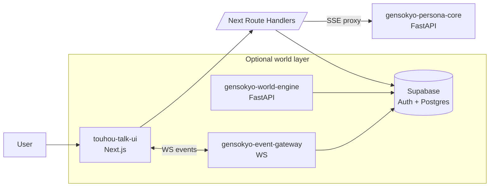

**Languages:** English | [日本語](README.ja.md)

# Project Sigmaris

Sigmaris is a working prototype of an **operable control plane for long-running LLM personas**.
Rather than relying on "whatever the model does inside a chat session", Sigmaris treats the model as a component and implements critical concerns **outside the model** as explicit software:

- Continuity across sessions (identity + memory orchestration)
- Deterministic control surfaces (routing, state machines, safety overrides)
- Observability (`trace_id` + structured `meta` you can store and inspect)
- Product-shaped integration (UI + persistence + optional world simulation modules)

## Repository modules

| Folder | What it is | README |
|---|---|---|
| `gensokyo-persona-core/` | FastAPI Persona OS engine (chat + streaming + external I/O tools) | `gensokyo-persona-core/README.md` |
| `touhou-talk-ui/` | Next.js UI (Supabase Auth, chat UX, optional Electron desktop wrapper) | `touhou-talk-ui/README.md` |
| `gensokyo-world-engine/` | World engine (commands/events log, time skip simulation; optional) | `gensokyo-world-engine/README.md` |
| `gensokyo-event-gateway/` | WS gateway streaming ordered world events from Supabase (optional) | `gensokyo-event-gateway/README.md` |
| `supabase/` | Canonical SQL schemas (`common_*`, world tables) | `supabase/RESET_TO_COMMON.sql` |
| `tools/` | Small dev tools (env audit/prune, etc.) | `tools/` |

## High-level architecture



## Quickstart (local dev)

### Prerequisites

- Node.js (LTS) + npm
- Python 3.11+
- A Supabase project (URL + anon key; service role key is server only)

### 1) Configure env (do not commit secrets)

This repo ignores `.env` by default. Use the example as your starting point:

```powershell
Copy-Item .env.example .env
```

Minimum keys to run the core + UI:

- `OPENAI_API_KEY`
- `NEXT_PUBLIC_SUPABASE_URL`
- `NEXT_PUBLIC_SUPABASE_ANON_KEY`
- `SUPABASE_SERVICE_ROLE_KEY` (server-side only)

### 2) Start the Persona OS core

```powershell
cd gensokyo-persona-core
python -m venv .venv
./.venv/Scripts/pip install -r requirements.txt
./.venv/Scripts/python -m uvicorn server:app --reload --host 127.0.0.1 --port 8000
```

OpenAPI docs: `http://127.0.0.1:8000/docs`

### 3) Start the UI

```powershell
cd touhou-talk-ui
npm install
npm run dev
```

UI: `http://localhost:3000`

## Environment variables

- `.env.example` is the source of truth for local dev.
- `npm run dev` for `touhou-talk-ui` intentionally loads the repo-root `.env` first (see `touhou-talk-ui/tools/dev.mjs`).
- For auditing/cleanup:

```powershell
node tools/env/env-audit.mjs
node tools/env/prune-dotenv.mjs --in .env --out .env.pruned
```

## Operational ethics (scope)

Sigmaris targets functional continuity and operational observability.
It does not claim consciousness, real feelings, or suffering.

- Avoid manipulative loops (guilt/pressure/dependency)
- If continuity degrades, disclose uncertainty instead of fabricating history

## Fan work notice (Touhou Talk UI)

`touhou-talk-ui/` is an unofficial fan work inspired by Touhou Project.
It is not affiliated with, endorsed by, or sponsored by the original creator/rights holders.

