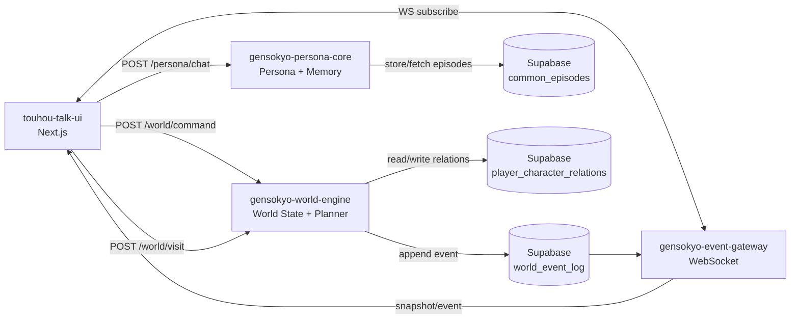

# 18 Character Relations / Character Scoped Memory / NPC Dialogue / Autonomous Simulation

この章は、Touhou-talk に「世界が動いている感」を追加するための未実装要素を、既存アーキテクチャを壊さずに足す手順をまとめる。

対象（追加実装）：

1. Character Relation System（player↔character）
2. Character Scoped Memory（episodic: user_id + character_id）
3. NPC to NPC Dialogue（npc_dialogue event）
4. Autonomous World Simulation（background world loop）

---

## 18.1 追加されるDB（Supabase）

### A) player_character_relations（Relation）

SQL: `supabase/player_character_relations.sql`

- key: `(user_id, character_id)`（unique）
- values: `affinity / trust / friendship / role / last_updated`
- RLS: `auth.uid() = user_id` のみ読み書き可能
- world-engine は Service Role で更新できる（RLS bypass）

### B) common_episodes.character_id（Episodic memory scope）

SQL: `supabase/common_episodes_character_scoped.sql`

- `common_episodes.character_id` を追加（nullable）
- index: `(user_id, character_id, timestamp desc)`

> 設計意図: 霊夢に話した内容を魔理沙が自動で知ることを防ぐ（= キャラ別に episodic memory を分ける）。

---

## 18.2 実装レイヤと責務（崩さない）

```
UI (touhou-talk-ui / Next.js)
  - world/loc/char を読み、表示を組む
  - persona_system を組み立てる（Relation + world_hint を「材料」として注入）
  - 会話生成は gensokyo-persona-core に委譲
  - 世界更新は world-engine に委譲（Command / Visit / Emit）

World Engine (gensokyo-world-engine / Python)
  - world_id + location_id の状態管理（world_state）
  - Event log（world_event_log）に append（RPC）
  - Command worker（world_command_log → event 反映）
  - BT planner（user_say/world_tick をトリガに npc_action / npc_say / npc_dialogue を生成）
  - 自律tick（visitベース + 追加の軽量ルール）

Persona / Memory (gensokyo-persona-core / Python)
  - 会話生成
  - episodic memory（common_episodes）への保存/検索
  - (user_id, character_id) でスコープ
```

---

## 18.3 新アーキテクチャ図（概念）



---

## 18.4 Relation（player↔character）の扱い

### 読み込み（UI側）

- Next.js route で `player_character_relations` を読み、`persona_system` に **ソフトに注入**する
- 注意: 数値はユーザーへ出さない（トーン/距離感のヒントに留める）

### 更新（world-engine側）

- 例: `user_say` が発生したら、`to` の `character_id` に対して `affinity/trust/friendship` を微増
- best-effort（テーブルが未作成でも落ちない）

---

## 18.5 Character Scoped Memory（gensokyo-persona-core）

実装ポイント：

- `SupabaseEpisodeStore` が `character_id` を受け取り、`common_episodes` を `user_id + character_id` でフィルタする
- migration 未適用（character_id列が無い）でも落ちないように、**列欠損を検知したらフォールバック**する

---

## 18.6 NPC↔NPC Dialogue（npc_dialogue event）

イベント形：

```json
{
  "type": "npc_dialogue",
  "payload": {
    "speaker": "reimu",
    "listener": "marisa",
    "text": "また来たの？"
  }
}
```

生成場所：

- BT planner（`world_tick` トリガ）で `npc_dialogue` を確率生成
- 自律tickでも `world_tick` 相当をトリガして混ぜられる

表示（UI）：

- `WorldEventLogPanel` で `[Reimu → Marisa] ...` の形式でレンダリングする

---

## 18.7 Autonomous World Simulation（background world loop）

目的：

- プレイヤーが操作していない間も `world_event_log` が流れる
- ただしコストは抑える（LLMは会話のみに限定、世界更新はルール）

実装方針（world-engine）：

- interval で `visit(visitor_key=world_simulator, user_time=now)` を呼ぶ
  - visitの time-skip logic を再利用できる
- 追加で「軽量ルール」を混ぜる
  - 例: 1NPCが隣接ロケーションに移動（確率）
  - 例: `world_tick` トリガで `npc_dialogue` を混ぜる

主要env：

- `GENSOKYO_WORLD_SIM_ENABLED=1`
- `GENSOKYO_WORLD_SIM_INTERVAL_SEC=30`
- `GENSOKYO_WORLD_SIM_WORLDS=gensokyo_main,gensokyo_test`
- `GENSOKYO_WORLD_SIM_LOCATIONS=hakurei_shrine,human_village`

---

## 18.8 ローカルでの最短確認

1) Supabase SQL を適用：
- `supabase/GENSOKYO_WORLD_SCHEMA.sql`
- `supabase/player_character_relations.sql`
- `supabase/common_episodes_character_scoped.sql`

2) gensokyo-persona-core 起動（例）：

```powershell
cd gensokyo-persona-core
python -m pip install -r requirements.txt
python -m uvicorn server:app --reload --port 8000
```

3) world-engine 起動（例）：

```powershell
python -m pip install -r gensokyo-world-engine/requirements.txt
cd gensokyo-world-engine
python -m uvicorn server:app --reload --port 8010
```

4) UI 起動（例）：

```powershell
cd touhou-talk-ui
npm i
npm run dev
```

5) UIでイベントログ確認：

- `/chat/session?world=gensokyo_main&loc=hakurei_shrine&char=reimu`
- World log に `world_tick` / `npc_dialogue` が流れる（WSゲートが起動している場合）
